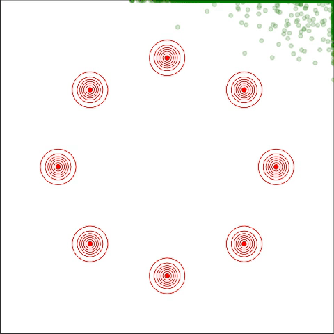

# SteinNS
This repository contains the code for the paper [Stein Neural Sampler](https://arxiv.org/abs/1810.03545). We implemented the KSD Neural Sampler (with the RBF or IMQ kernels) and the Fisher Neural Sampler in TensorFlow. 

## Toy example
The toy example is an equal mixture of eight Gaussians equally spaced on a circle of radius 15. The red lines indicates the target distribution, and the green points represents the 2000 samples at each iteration. 

## Comments
For any feedbacks/comments, please feel free to shot us an <a href="mailto:sun652@purdue.edu?subject=Comments on SteinNS">email</a>.
